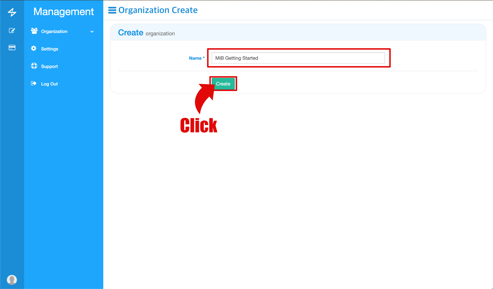
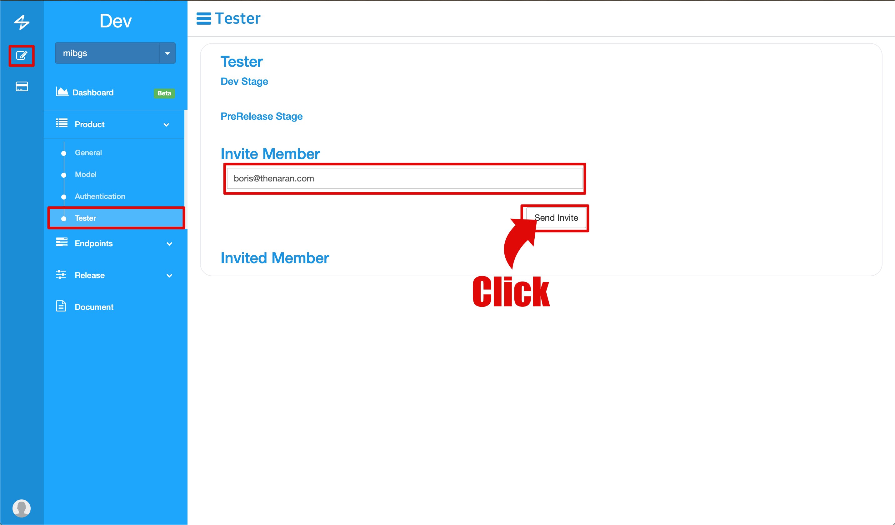
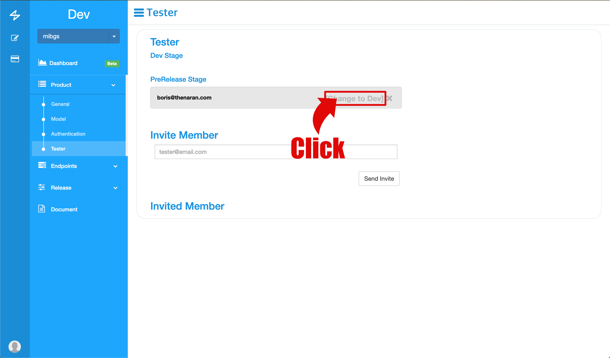
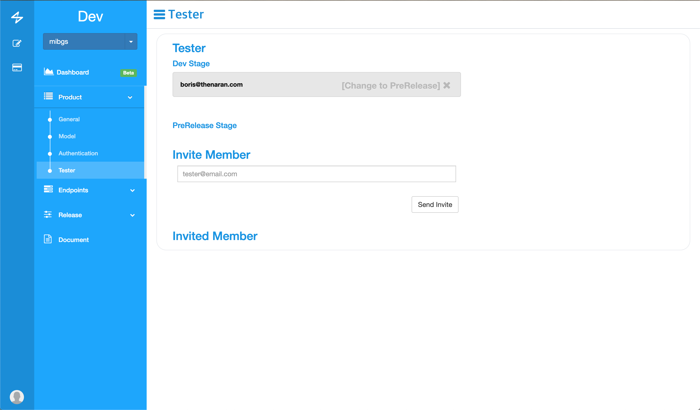
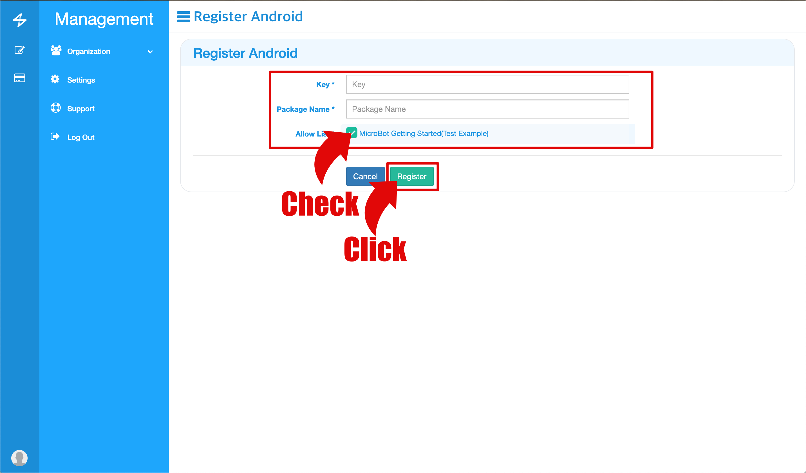

Overview
====
This guide allows you to connect Bluetooth gadgets to the MiB IoT Platform. This guide briefly describes the process of deployment through the MiB Console.

## Defination
* Gadget: This term indicates a Bluetooth device. The MicroBot Push, MicroBot Alert is one of the gadgets.
* Specifications: This term indicates the endpoint to be used for the gadget. The requests item gives commands to the gadget, and the events item comes from the gadget. It is possible to manage through version.

## Step
1. [Console Registration](#console)
1. [Create Organization](#organization)
1. [Create Product](#product)
1. [Create Model](#model)
1. [Registration of Specification](#endpoint)
1. [Firmware registration](#firmware)
1. [Test](#test)
1. [Release](#release)

## More
1. [Update](#update)
1. [External Server Connection](#3rd)
1. [Notification Registration](#noti)

## MiB Console
To develop, test, and deploy through the MiB IoT Platform, you must use the MiB Console.

1. Visit [Console](https://console.mib.io) to sign up
**NOTE: If you already have an organization, please send an invitation email to members.*

## Organization
1. Create the organization
1. Invite other developers to your organization. Note that if an uninvited member joins the console, he or she can not add it as a member

## Products
1. Register the product name and ID. The product name is the product name that is served to the actual user and the ID is used to identify the product on the platform. The product ID also appears in the list when you scan the Bluetooth gadget. The product ID can only be in English lower case and it must be 10 characters

##  Model
1. Select the name and type to register the model. Models can be useful when you want to make a difference in version or function even if they are the same product. Basically, at least one model must be registered per product.
**Currently supported models are NRF51 and NRF52.*

## Endpoint Specification
Defines the Endpoint and Event that the gadget needs to work with. Through the defined statement, MiB IoT Platform invokes the Endpoint and dispatches Event

1. Go to [Product]-[Model] menu and get the Example file
1. Unzip the downloaded file and refer to the specification example file to define the endpoint and the event.[Link](https://github.com/thenaran/document/blob/master/microbot-nrf/README.md#define-endpoints-or-events-on-microbotcloud)
1. Upload the created statement to [Console](https://console.mib.io) and register it

## Firmware
1. Go to the [Endpoints]-[Specifications] menu and click Header.
1. Select the model and download the header file
1. Create the firmware using the downloaded header file. Please refer to the following link. [Link](https://github.com/thenaran/document/blob/master/microbot-nrf/README.md)
1. To register the created firmware, go to [Product]-[Model] and click Register button
1. Upload the created firmware and register it. Notice that the version shown in the following screen should be the same as the version of the downloaded header file

##  Mobile apps
Create mobile applications to control gadgets with MicroBot SDK. Through the mobile application, the gadget communicates with the MiB IoT Platform. Please develop your mobile application with the following information.
### iOS
* [Getting started for Swift](https://github.com/thenaran/document/blob/master/microbot-swift/README.md)

#### Sample App for iOS
* In the Sample App, you can connect/disconnect Bluetooth, and make basic endpoint calls. For more information, please contact support@thenaran.com.

### Android
* Coming soon.

#### Sample App for Android
* Coming soon.

##  Test
Although you can control and check the gadget directly through your mobile application, you can test the Endpoint and Event more easily and quickly through the specs defined through [Console](https://console.mib.io). To test, you must first register the test user. Developers can also test by registering as a test user.

1. Send an invitation email to the user to test
1. If the recipient accepts the email, it will be added to the PreRelease Stage. To test in the MiB Console, change to Dev Stage
1. You need to have a user in the Dev Stage as below to test in the Test item of MiB Console
1. Go to [Endpoints]-[Tests].
1. Press the test button to confirm the function.

##  Deploy
You can check the product you are developing at each step before you deploy it. A description of each step follows.

* Release: Information about the version currently being serviced to the user.
* Pre Release: This is a pre-release testing phase. Users of the Pre Release phase are available.
* Dev: Information of the version currently under development. It is used by tester of Dev stage.
* Archive: When a new version is released, the previous version information will be kept here.

1. Press the Pre Release button and the version in the current Dev Stage will be reflected in the Pre Release Stage.
1. In the Pre Release phase, you can send a test email to an external user to proceed with the test.
1. When you have completed the pre-release test, click the Release button. Once the deployment is complete, it is available to the general public.

## Update
1. If there are any changes, register the new statement.
1. After downloading the header file from the registered statement, create the firmware and register the firmware.
1. Update the gadget through the mobile application using the API to upgrade the registered firmware.
1. Deploy to another stage through the Release menu to test or provide to users.

##  Connecting to an external server
If you are operating a separate server, you can control the gadget through the API provided by MiB IoT Platform. Please refer to the document below.

* [Getting started for 3rd Party](https://github.com/thenaran/document/blob/master/microbot-cloud/3rdapis.md)

##  Notification Registration
To send notifications to IOS and Android mobile apps, please register as below.

#### IOS
1. Click Register IOS.
1. Upload Bundle ID, Password, p12 file and register.
** Please note: Please register your Dev and Production status carefully *

#### ANDROID
1. Click Register Android.
1. Enter the Key and Package Name and register.
