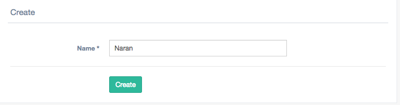
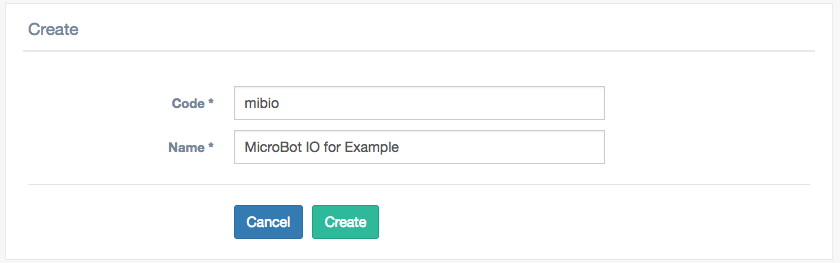
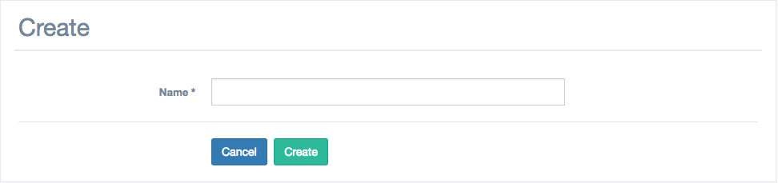
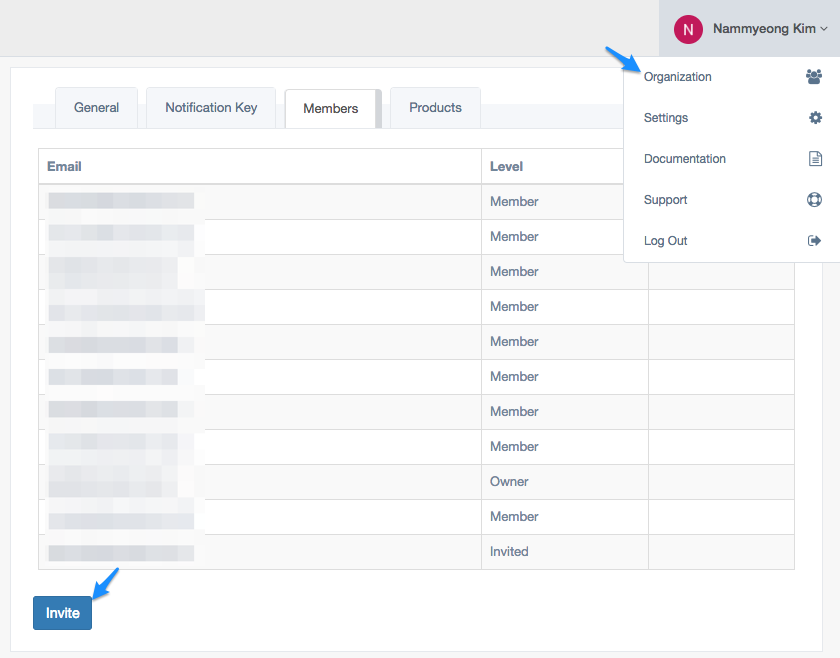
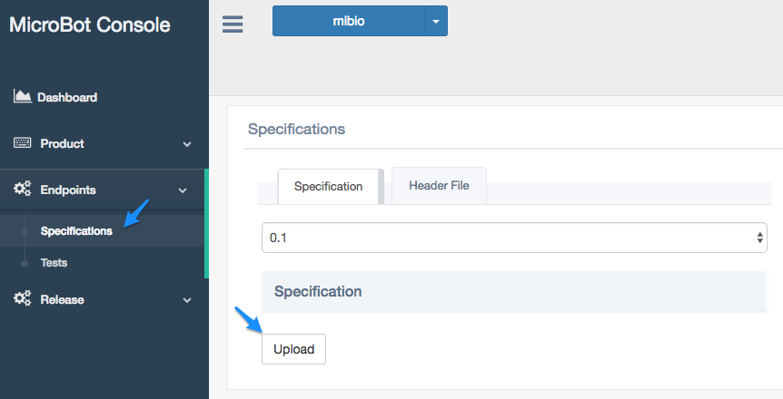
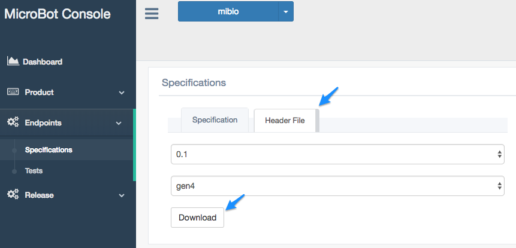
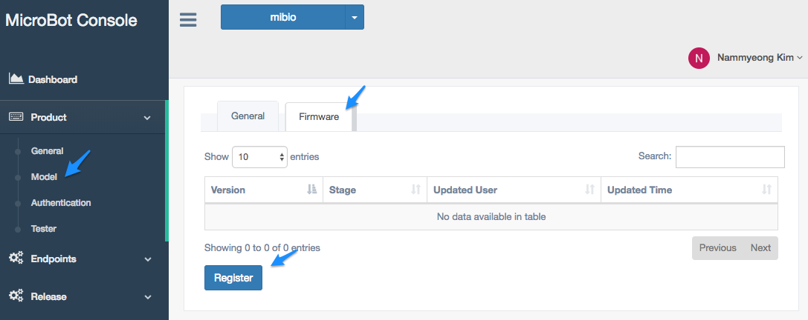
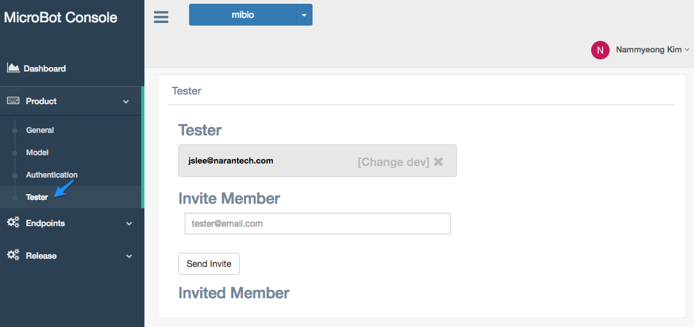
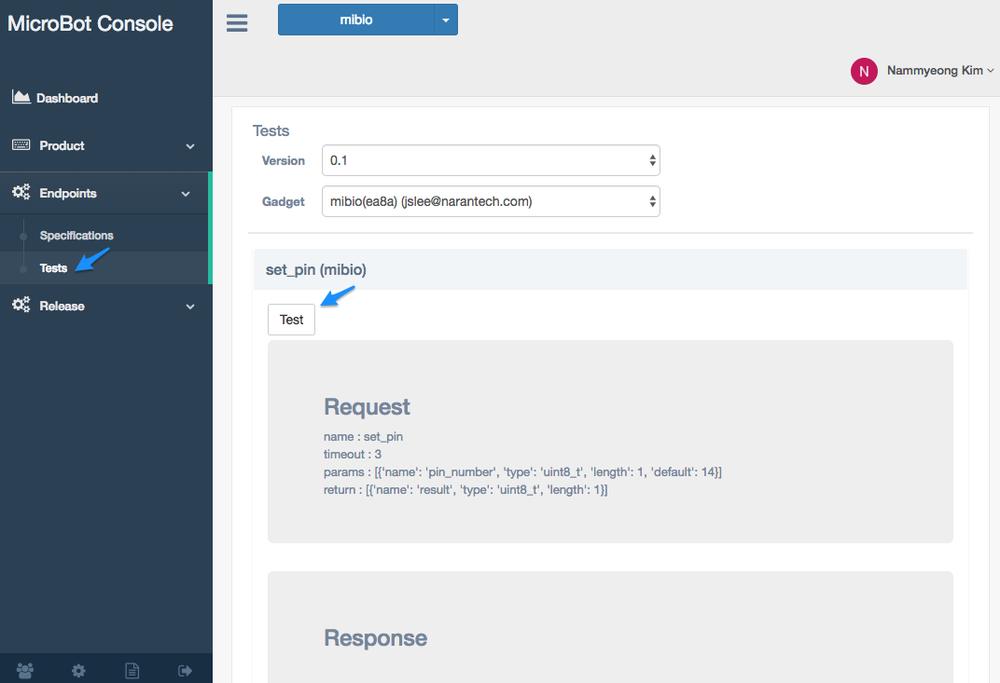
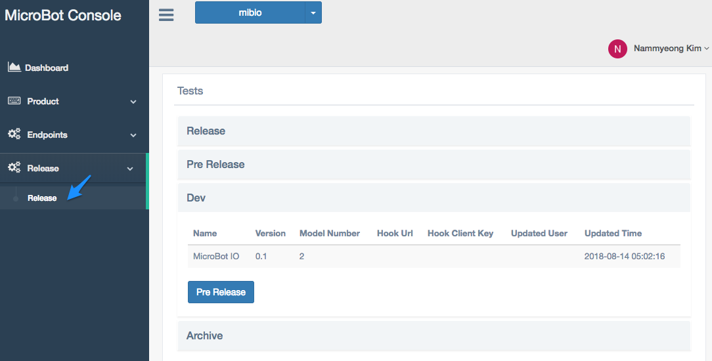

Introduction
===
이 가이드를 통해 블루투스 가젯을 마이크로봇 플랫폼에 연결 할 수 있습니다. 가이드는 크게 API 명세서와 펌웨어 및 모바일 Kit 적용, 그리고 테스트 및 배포를 다루고 있습니다.

마이크로봇 플랫폼에 연결 하기 위해서는 크게 다음과 같은 작업을 필요로 합니다. 필요한건 블루투스 가젯 하나뿐 입니다.

1. [콘솔 등록](#console)
1. [명세서 정의](#endpoint)
1. [펌웨어](#firmware)
1. [모바일 앱](#mobile)
1. [테스트](#test)
1. [배포](#deploy)
1. [업데이트](#update)
1. [서버 연결](#3rd)

## MicroBot Console
Naran과 동일한 인프라에서 MicroBot Platform을 개발, 테스트, 배포 할 수 있습니다.

1. [Console](https://console.mib.io)에 방문하여 가입 하세요
1. 먼저 그룹을 등록 합니다.
1. 제품과 코드를 등록하세요. 제품명은 실제 사용자에게 서비스 되는 제품명이며 코드는 플랫폼에서 제품을 식별하는데 사용 됩니다.
1. 모델을 등록 합니다. 모델은 같은 제품이더라도 버전이나 기능에 차이를 두고 싶은 경우에 유용하게 활용 할 수 있으며 기본적으로 제품당 최소 1개의 모델이 등록 되어야 합니다.
1. 조직에 다른 개발자를 초대하세요
	*조직원이 초대가 아닌 콘솔에서 직접 가입하게 되는 경우 새로운 조직에 속하게 됩니다.*

## Endpoint 명세서
가젯이 동작하는데 필요한 Endpoint와 이벤트를 정의합니다. 정의된 명세서를 통해 마이크로봇 플랫폼은 가젯의 Endpoint를 호출 하고 이벤트를 사용자의 다른 허브에 전달 합니다.

1. 먼저 가젯 Endpoint 및 이벤트를 정의 합니다. [Link](https://github.com/thenaran/document/blob/master/microbot-nrf/README.md#define-endpoints-or-events-on-microbotcloud)
1. 만들어진 명세서를 [Console](https://console.mib.io)에 업로드하여 등록 합니다.

## 펌웨어
1. 생성된 가젯 헤더를 다운 받아 펌웨어에 적용 합니다. [Link](https://github.com/thenaran/document/blob/master/microbot-nrf/README.md)	
1. 만들어진 펌웨어를 모델에 적용 합니다.

## 모바일 앱
MicroBot SDK가 적용된 가젯을 제어한 모바일 어플리케이션을 제작 합니다. 마찬가지로 플랫폼에 해당 하는 SDK를 통해 어플리케이션을 제작 합니다.
### iOS
* [Getting started for Swift](https://github.com/thenaran/document/blob/master/microbot-swift/README.md)

#### Sample App for iOS
* 별도의 모바일 어플리케이션을 제작 하지 않아도 샘플 앱을 통해 기본적인 동작을 확인할 수 있습니다.

### Android
* Kotlin: WIP

## 테스트
모바일 어플리케이션을 통해 가젯을 직접 제어하고 확인해 볼 수 있지만 [Console](https://console.mib.io)을 통해 정의된 명세서를 통해 Endpoint 및 Event를 좀 더 쉽고 빠르게 테스트 해볼 수 있습니다.

1. 테스트를 진행할 사용자를 먼저 추가하세요.
	* 필요한 경우 외부 테스터를 추가하여 Pre Relase 버전을 사용해 볼 수 있습니다.
1. MicroBot SDK가 적용된 가젯과 모바일 어플리케이션을 준비하세요.
1. [Console](https://console.mib.io)에서 Endpoint 테스트 페이지로 이동 합니다.
1. 테스트 버튼을 눌러 기능을 확인 합니다. 
1. 개발중인 버전을 Pre Release 스테이지로 변경 합니다.([배포](#deploy)참조)

## 배포
개발중인 제품을 릴리즈 하기 전 각 스테이지에서 점검해 볼 수 있습니다.

* Release: 현재 사용자에게 서비스 되고 있는 버전 입니다.
* Pre Release: 릴리즈 전 테스트 해볼 수 있는 버전 입니다.
* Dev: 현재 개발 중인 버전 입니다.
* Archive: 새로운 버전이 릴리즈 되면 이전 버전은 이곳에 보관되게 됩니다.

## 업데이트
1. 필요하다면 새로운 명세서를 등록 합니다.
1. 모델에 새로운 펌웨어 파일을 업로드 합니다. 새로운 펌웨어가 등록되면 모바일 SDK에서 사용자 가젯의 펌웨어를 업데이트 할 수 있도록 API가 제공 됩니다.
1. Release 메뉴를 통해 다른 스테이지에 배포하여 테스트 하거나 사용자에게 제공 합니다.

## 외부 서버 연결
별도의 서버를 운용중인 경우 MicroBot Cloud에서 제공하는 API를 통해 가젯을 제어할 수 있습니다.