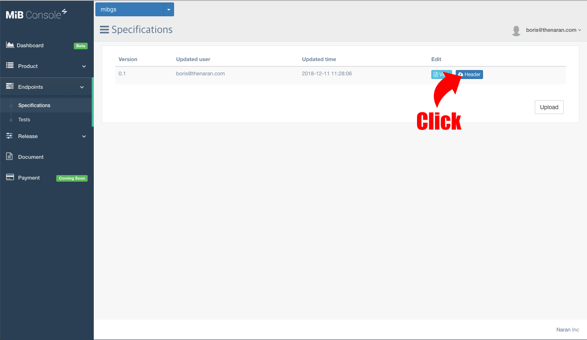

개요
====
이 가이드를 통해 블루투스 가젯을 MiB IoT Platform에 연결 할 수 있습니다. 이 가이드는 MiB Console을 이용하여 배포까지의 과정을 간략히 담고 있습니다.

## 주요용어
* 가젯(Gadget) : 블루투스 기기를 명칭합니다. 대표적으로 나란의 MicroBot Push, MicroBot Alert이 가젯의 한 종류입니다.
* 명세서(Specifications) : 가젯에서 사용될 endpoint를 정의합니다. requests 항목은 가젯에게 명령을 내리며, events 항목은 가젯으로 부터 발생합니다. 버전을 통해서 관리가 가능합니다.

## 순서
1. [콘솔 등록](#console)
1. [조직 생성](#organization)
1. [제품 생성](#product)
1. [모델 생성](#model)
1. [명세서 등록](#endpoint)
1. [펌웨어 등록](#firmware)
1. [테스트](#test)
1. [배포하기](#release)

## 더보기
1. [업데이트](#update)
1. [외부서버연결](#3rd)
1. [Notification등록](#noti)

## MiB Console
MiB IoT Platform을 통해 개발, 테스트, 배포를 하기 위해서는, MiB Console을 사용해야 합니다.

1. [Console](https://console.mib.io)에 방문하여 가입 하세요
**주의 : 조직이 이미 존재한다면 구성원에게 초대메일을 받아서 가입하시길 바랍니다.*

## 조직
1. 조직을 생성 합니다.
1. 조직에 다른 개발자를 초대하세요. 초대 받지 않은 조직원이 콘솔에 가입을 하게 된다면, 조직원으로 추가 할 수 없음을 명심하세요.

## 제품
1. 제품의 이름과 아이디를 등록하세요. 제품명은 실제 사용자에게 서비스 되는 제품명이며 아이디는 플랫폼에서 제품을 식별하는데 사용 됩니다. 또한 제품 아이디는 블루투스 가젯의 스캔시에 목록에 표시됩니다. 제품 아이디는 영어 소문자만 가능하며, 10자이하여야 합니다.

## 모델
1. 이름과 종류를 선택하여 모델을 등록 합니다. 모델은 같은 제품이더라도 버전이나 기능에 차이를 두고 싶은 경우에 유용하게 활용 할 수 있으며 기본적으로 제품당 최소 1개의 모델이 등록 되어야 합니다. 
	**현재 지원되는 모델의 종류는 NRF51과 NRF52 입니다.*

## Endpoint 명세서
가젯이 동작하는데 필요한 Endpoint와 Event를 정의합니다. 정의된 명세서를 통해 MiB IoT Platform은 Endpoint를 호출 하고 Event를 전달 합니다서

1. [Product]-[Model]의 메뉴로 이동 후 Example 파일을 받습니다.
1. 다운로드 받은 파일의 압축을 해제 후 명세서 예제파일을 참고하여 Endpoint 및 이벤트를 정의 합니다. [Link](https://github.com/thenaran/document/blob/master/microbot-nrf/README.md#define-endpoints-or-events-on-microbotcloud)
1. 작성한 명세서를 [Console](https://console.mib.io)에 업로드하여 등록 합니다.

## 펌웨어
1. [Endpoints]-[Specifications] 메뉴로 이동하여 Header를 클릭합니다..
1. 모델을 선택하여 헤더파일을 다운로드 받습니다.
1. 다운로드 받은 헤더파일을 이용하여 펌웨어를 생성합니다. 다음의 링크를 참고해주세요. [Link](https://github.com/thenaran/document/blob/master/microbot-nrf/README.md)
1. 생성한 펌웨어를 등록하기 위하여 [Product]-[Model]로 이동을 하여 Register 버튼을 클릭합니다.
1. 생성한 펌웨어를 업로드하여 등록을 합니다. 주의사항은 아래의 화면에서 보이는 버전과 다운로드 받은 헤더파일의 버전이 같아야 합니다.

## 모바일 앱
MicroBot SDK가 적용된 가젯을 제어할 모바일 어플리케이션을 제작합니다. 모바일 어플리케이션을 통해 가젯은 MiB IoT Platform과 통신을 합니다. 아래의 내용을 참고하여 모바일 어플리케이션을 개발해주세요.
### iOS
* [Getting started for Swift](https://github.com/thenaran/document/blob/master/microbot-swift/README.md)

#### Sample App for iOS
* Sample App에서는 블루투스 연결/해제, 기본적인 Endpoint 호출 등을 해볼수 있습니다. 관련 내용은 support@thenaran.com으로 문의주세요.

### Android
* 준비중입니다.

#### Sample App for Android
* 준비중입니다.

## 테스트
모바일 어플리케이션을 통해 가젯을 직접 제어하고 확인해 볼 수 있지만 [Console](https://console.mib.io)을 통해 정의된 명세서를 통해 Endpoint 및 Event를 좀 더 쉽고 빠르게 테스트 해볼 수 있습니다. 테스트를 위해서는 먼저 테스트 사용자를 등록하여야 합니다. 개발자 또한 테스트 사용자로 등록을 하여야 테스트를 할 수 있습니다.

1. 테스트를 할 사용자에게 초대 이메일을 발송합니다.
1. 이메일을 받은 사용자가 수락을 하면 PreRelease Stage로 추가가 됩니다. MiB Console에서 테스트를 위해서는 Dev Stage로 변경하여야 합니다.
1. 아래와 같이 Dev Stage에 사용자가 있어야 MiB Console의 Test항목에서 테스트가 가능합니다.
1. [Endpoints]-[Tests]로 이동 합니다.
1. 테스트 버튼을 눌러 기능을 확인 합니다. 

## 배포
개발중인 제품을 배포 하기 전 각 단계에서 점검해 볼 수 있습니다. 각 단계에 대한 설명은 다음과 같습니다.

* Release: 현재 사용자에게 서비스 되고 있는 버전의 정보입니다.
* Pre Release: 릴리즈 전 테스트 해볼 수 있는 단계입니다. Pre Release 단계의 사용자들이 사용가능합니다.
* Dev: 현재 개발 중인 버전의 정보입니다. Dev 단계의 테스터들이 사용합니다.
* Archive: 새로운 버전이 배포가 되면 이전 버전의 정보가 이곳에 보관되게 됩니다.

1. Pre Release 버튼을 누르면 현재 Dev Stage에 있는 버전이 Pre Release Stage에 반영이 됩니다.
1. Pre Release 단계에서 외부 사용자에게 테스트 메일을 발송하여 테스트를 진행 할 수 있습니다.
1. Pre Release 단계의 테스트가 완료되면 Release 버튼을 눌러 배포하세요. 배포가 완료되면 일반 사용자들도 이용이 가능합니다.

## 업데이트
1. 변경된 사항이 있다면 명세서를 새로 등록합니다.
1. 등록된 명세서에서 헤더파일을 다운로드 받은 후 펌웨어를 생성 후 펌웨어를 등록합니다.
1. 등록된 펌웨어를 업그레이드 할 수 있는 API를 이용하여 모바일 어플리케이션을 통해 가젯을 업데이트 합니다.
1. Release 메뉴를 통해 다른 스테이지에 배포하여 테스트 하거나 사용자에게 제공 합니다.

## 외부 서버 연결
별도의 서버를 운용중인 경우 MiB IoT Platform에서 제공하는 API를 통해 가젯을 제어할 수 있습니다. 아래의 문서를 참고해 주세요.

* [Getting started for 3rd Party](https://github.com/thenaran/document/blob/master/microbot-cloud/3rdapis.md)

## Notification 등록
IOS, 안드로이드의 모바일앱에 Notification을 전송하기 위해서는 아래와 같이 등록을 하여주세요.

#### IOS
1. Register IOS를 클릭합니다. 
1. Bundle ID, Password, p12파일을 업로드하여 등록을 합니다. 
**주의: Dev, Production 상태를 주의해서 등록해주세요*

#### ANDROID
1. Register Android를 클릭합니다. 
1. Key, Package Name을 입력 후 등록을 합니다. 
