# MicroBot Kotlin Getting Started

## Overview
This document contains a description of initial setup and basic function usage when developing Kotlin.


## History
 * 2019-03-27
 	* Android SDK First Realese

## Step
1. [Prerequisites](#Prerequisites)
1. [Installation](#Installation)
1. [Usage](#Usage)

## Prerequisites

Before you begin, you need to set up a few things in your environment:

* JDK 8 is recommanded.
* Android API level 26 or higher.
* Kotlin version 1.3 or higher.
* For MicroBot:
  * A physical Gadget & Android device.
  * An Android Push Notification Key for your Google Developer account.

## Installation
#### Remote repository
 * comming soon

#### Manually

 1. Download the MicroBot Kotlin-SDK [(Download)](https://github.com/thenaran/document/blob/master/microbot-kotlin/release/0.0.1/microbot_sdk.zip)

 1. Unzip the downloaded SDK and move the Framework file to the project folder

 1. For implement SDK to your project, Write down the path of the SDK you moved into your project, in the [reportories]-[maven] and [dependencies] section

	 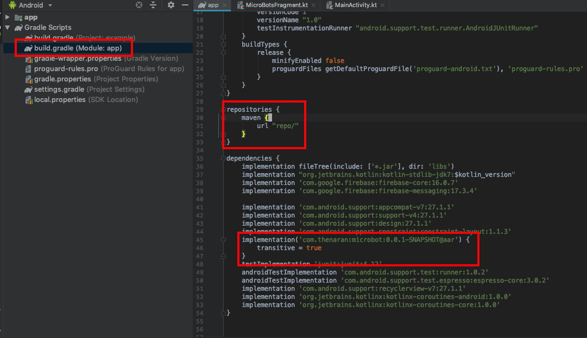
	 
 1. If you'd done all the above steps, click the [Sync Now] button

 	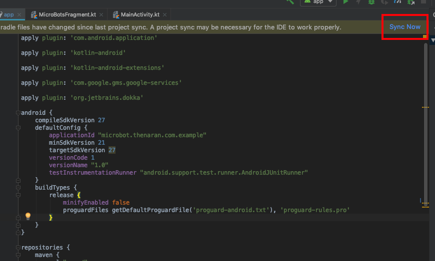
 	
 1. If you see a message that "synced successfully", it means that the SDK has been implemented in your project.

 	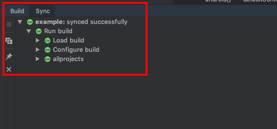


## Configuration
#### Setting FirebaseSevice in Android Project
1. Please refer to the following link to create and configure Firebase Project.
 * Link : [Link](#https://console.firebase.google.com/)

1. Make you Firebase project first.

	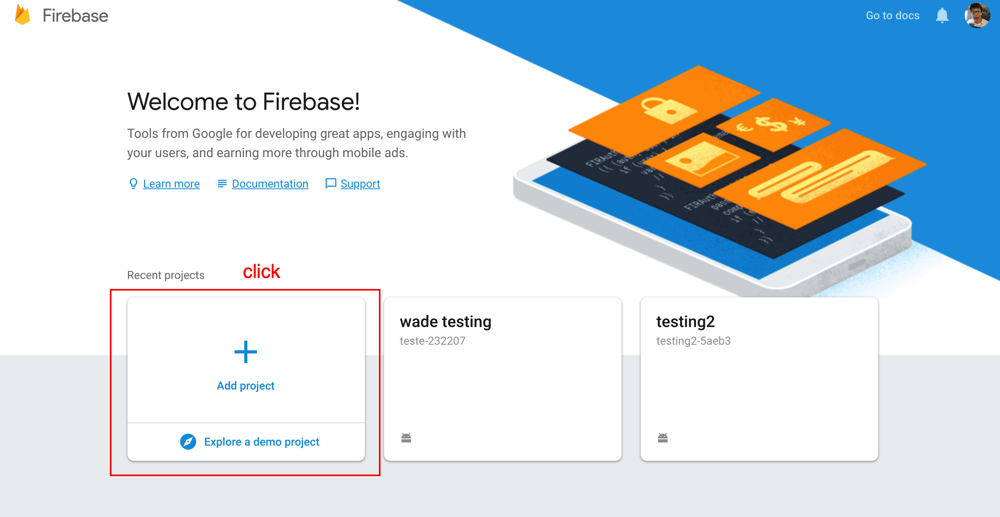

1. Add your Project name and click check box.

	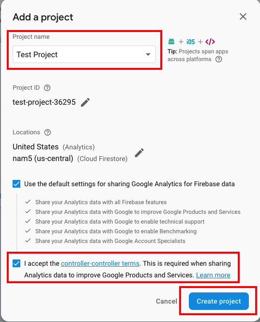

1. Add your app setting and click Android Icon. 

	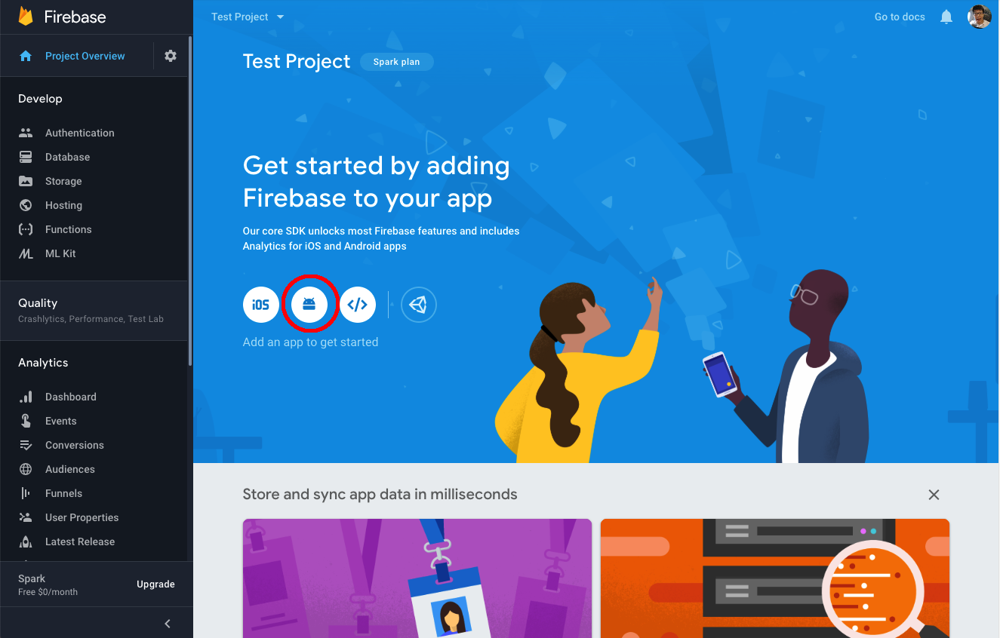

1. Fill Android packge name field. Remaining field is optional field. If you want, can fill that filed.

	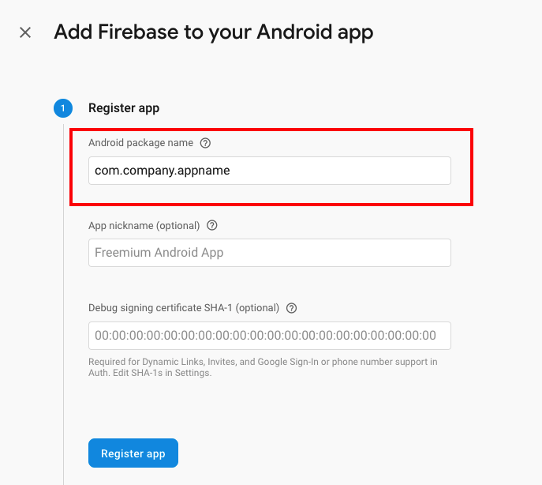

1. Click download buttton, and Move the file to app folder in your project.

	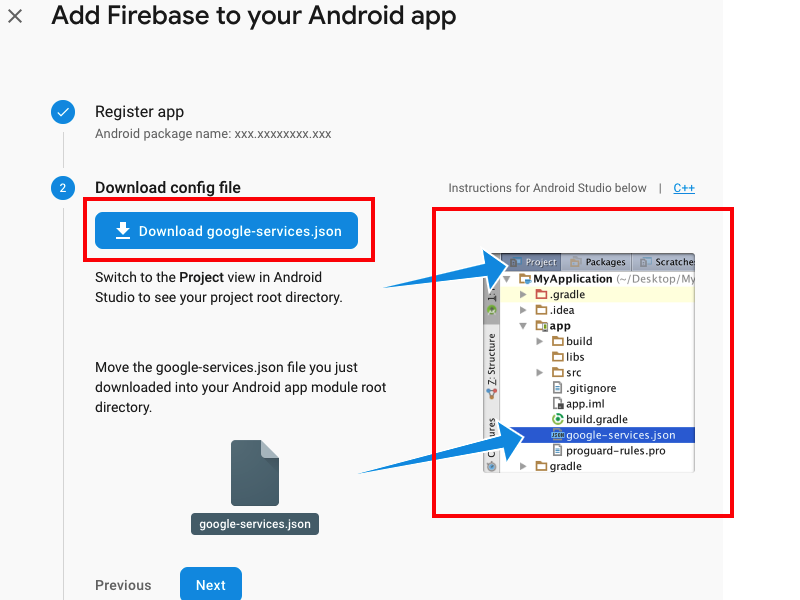

1. After you add code to Project-level Gardle file and App-level gradle file, [Sync now] button will show. Click the button.

	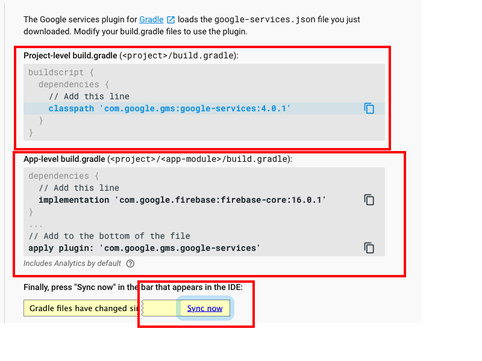
	
1. Add service to your Firebase in AndroidManifest.xml for app level.

	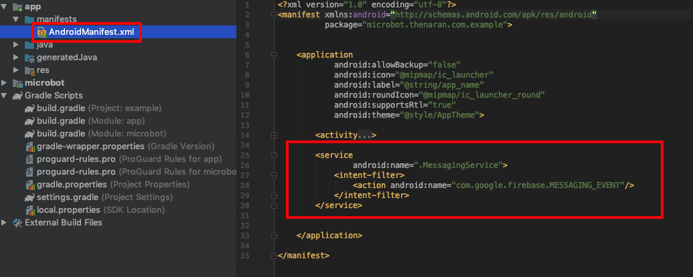
	
	
#### Configuring Notification key

1. Go to Firebase Project and click [Setting Icon] - [Project setiings]
	
	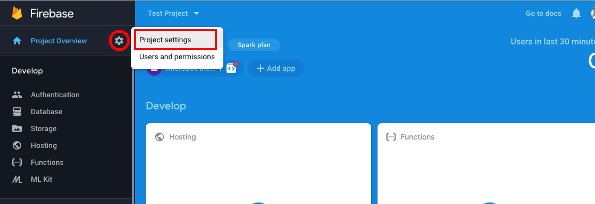

1. Go to [Cloud Messaging] tab and copy [Sever Key]

	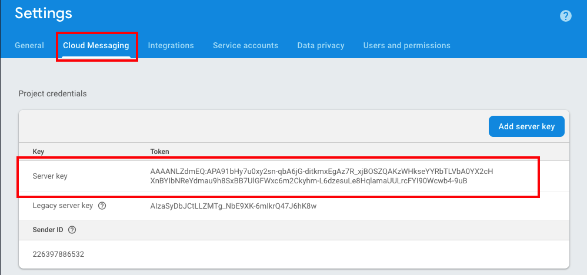

1. Go to the MiB Console and click [Organization] of the profile in the upper right corner.

	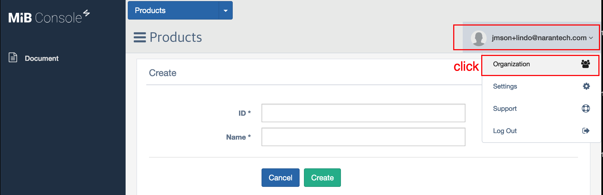

1. Go to the [Notification Key] tab and click the [Register IOS] button.

    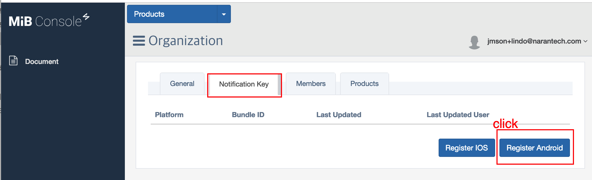

1. Fill in the following items. If it all done, click [Register] button
	* Key : Paste server key that copied from Firebase Console
	* Package Name : Your Package name of Android Project

	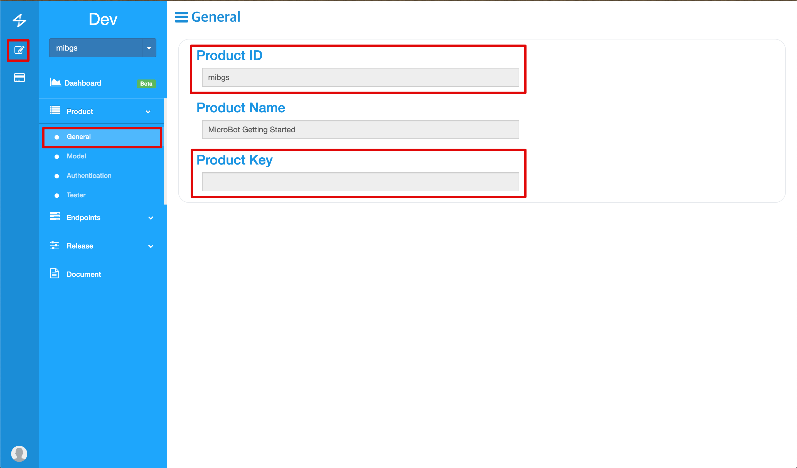

#### Add Your Product keys
You need to add a product key to communicate with gadgets. Follow the steps below to add the product key.

1. Access the MiB console and go to [Product] - [General]. Copy the Product ID and Product Key values shown on the screen.

	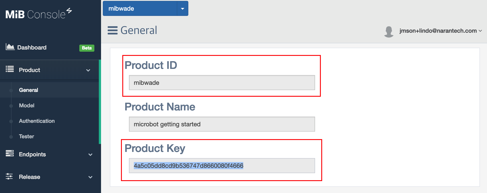

1. Add your product key in statrtService code of your class 

```kotlin
val productKeyMap = hashMapOf("your_gadget_name" to "enter_your_product_key_from_mib_console") // https://console.mib.io
mibIntent.putExtra("productKeys", productKeyMap)
startService(mibIntent)
```


## Usage 

#### Initialize

```kotlin
// Start MicroBot service in thread
val mibIntent = Intent(this, MicroBotService::class.java)
startService(mibIntent)

/*
    Adds your product key.
    this key is example. not work
*/
val productKeyMap = hashMapOf("your_gadget_name" to "enter_your_product_key_from_mib_console") // https://console.mib.io
mibIntent.putExtra("productKeys", productKeyMap)
startService(mibIntent)


/*
    This function work for Firebase Messaging.
    If your current token and server's token values are different, Creates a new token value.
*/
FirebaseInstanceId.getInstance().instanceId.addOnCompleteListener {
    if (it.isSuccessful) {
        val currentToken = it.result?.token ?: ""
        if (MicroBot.message.token != currentToken) {
            MicroBot.message.token = currentToken
        }
    }
}
```

#### Receive Events

```kotlin
class EventHandler : ReceiveEvent {

    override fun mibReceivedAuthEvent(user: MIBUser, topic: String, data: Map<String, Any>?) {
        if (topic == "authorized") {
            Log.d("Event Result : ", "${user.email} is Authorized")
        } else {
            Log.d("Event Result : ", "${user.email} is Unauthorized")
        }
    }

    override fun mibReceivedGadgetEvenet(gadget: MIBGadget, topic: String, data: Map<String, Any>?) {
        Log.d("Event Result : ", "${gadget.name} is $topic : ${data.toString()}")
    }

    override fun mibReceivedHubEvent(gadget: MIBHub, topic: String, data: Map<String, Any>?) {
        Log.d("Event Result : ", "${gadget.name} is $topic : ${data.toString()}")
    }
}
```

#### Authorize User
```kotlin
// Sending MagicLink to your Email for authorize account.
MicroBot.auth.authorize(email)

internal class EventHandler : ReceiveEvent {
    // Recieve an authroization event from MIBReciever
    override fun mibReceivedAuthEvent(user: MIBUser, topic: String, data: Map<String, Any>?) {
        if (topic == "authorized") {
            Log.d(TAG, "${user.email} is Authorized")
        } else {
            Log.d(TAG, "${user.email} is Unauthorized")
        }
    }
}
```
#### Scan Gadgets
```kotlin
// Use scanning unpaired gadget, before try to pair
MicroBot.gadgets.scan().done { response ->
    response.data?.let {
        if (it.name.isNotBlank()) {
            Log.d(TAG, "${it.name} is Scaned")
        }
    } ?: run {
        Log.d(TAG, "Failed Gadget Scanning.")
    }
}


```
#### Pair and Unpair with The Gadget
```kotlin
// Try to pair your gadget
gadget.pair(otpSecret = otp).done { response ->
    Log.d(TAG, "Try to pair result : ${response.data}")
}

// Try to unpair your gadget
gadget.unpair().done { response ->
    Log.d(TAG, "Try to unpair result : ${response.data}")
}

internal class EventHandler : ReceiveEvent {
    // Recieve an authroization event from MIBReciever
    override fun mibReceivedGadgetEvent(gadget: MIBGadget, topic: String, data: Map<String, Any>?) {
        if (topic == "paired") {
            Log.d(TAG, "${gadget.name} is Paired")
        } else if (topic == "unpaired") {
            Log.d(TAG, "${gadget.name} is Unpaired")
        }
    }
}

```

#### Call an Endpoint of The Gadget
```kotlin
pinNumber = editPinNumber.text.toString().toInt()
// Use to send order your gadget
selectedGadget.callEndpoint(0, "clear_pin", pinNumber).done { response ->
    Log.d("set_pin result", "${response.data}")
}

```
