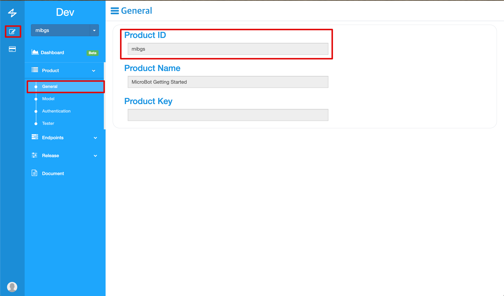
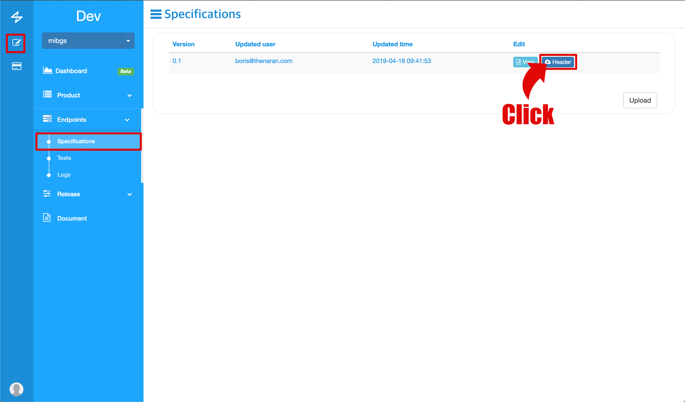

# Microbot-NRF SDK Getting started

This guide provides a more detailed description of the NRF development.

## History
* 2019-02-22 : Overall changes have been made.

## Defination

* NRF51 : NRF51 includes NRF51422 and NRF51822
* NRF52 : NRF52 includes NRF52832

## Step

1. [Prerequisite](#prerequisite)
1. [Program Setup](#program)
1. [Write of specification](#specification)
1. [Download Header File](#headerfile)
1. [Firmware](#firmware)

## More

1. [Firmware Update](#firmware_update)
1. [Sample File](#sample)
1. [Specification description](#specification_description)

## <a name="prerequisite"></a>Prerequisite

#### OS

Firmware is currently available only in the Window environment. We will apply at Mac in the future.

#### Development Hardware Kit

It currently supports Nordic's NRF51 and NRF52.

Naran is developing a board by customizing NRF51 and is scheduled to be released soon. We call this MicroBot IO, and the information can be viewed at the following link

* MicroBot IO : [Link](https://microbot.is/others/)

The Nordic development board links are as follows.

* NRF51 : [Link](https://www.nordicsemi.com/Software-and-Tools/Development-Kits/nRF51-DK)
* NRF52 : [Link](https://www.nordicsemi.com/Software-and-Tools/Development-Kits/nRF52-DK)

## <a name="program"></a> Program Setup

1. Download the Nordic NRF5x SDK v11.0.0.
    * Download Link : [DOWNLOAD](https://developer.nordicsemi.com/nRF5_SDK/nRF5_SDK_v11.x.x/nRF5_SDK_11.0.0_89a8197.zip)
2. Unzip the downloaded file and run nRF5x_MDK_8_5_0_Keil4.msi to install it.
3. Go to the following link and select MDK-Arm to download the IDE.
    * You can download it after you sign up.
    * Keil uVision4 or later IDE is required.
    * Link : [Link](https://www.keil.com/download/product/)
4. Install the downloaded file.
5. Download the J-Link driver.
    * Download Link : [DOWNLOAD](https://www.segger.com/downloads/jlink/JLink_Windows.exe)
6. Install the downloaded file.

## <a name="specification"></a> Write of specification

You can create a Firmware file, you must complete a specification. Fill out the specification as follows:

1. Access the [MiB Console](https://console.mib.io), go to the [Product]-[Model] and Download example file.

    

1. Unzip the downloaded file and open the example.json file.

    

1. Write the Product ID into the Product item in the specification. The value of the Product item in the specification and the Product ID of the MiB Console must be the same. Product ID can be found in the Mib Console under [Product] - [General].

    
    

1. Save the specification and upload it to the MiB console. Upload is possible after move to [Endpoints] - [Specifications] in the MiB Console.

    

1. Move to the next path in the compressed example file folder that you saved specification.

    

## <a name="headerfile"></a> Download Header File

A header file is required to create a firmware file. This header file is made based on the specification. The header file can be accessed to the console and downloaded. Download the header file as follows

1. Access to the [MiB Console](https://console.mib.io),  go to [Endpoints] - [Specifications] and click on the following menu to download the header file.

    

1. Select the model you want to create and click [Download] to download the header file.

    

1. Move the downloaded header file to the following path.

    

## <a name="firmware"></a> Firmware

You can create firmware through the example file you downloaded and the program you installed. Use the steps below to create firmware.

#### Prerequisite

1. Connect the development board to the computer on which the program is installed.
1. Run the Keil uVersion program and add a sample project. Add a project from the [Project] - [Open Project...] menu and add a file from the path below.
    * NRF51

        

    * NRF52

        

1. Sometimes you may be asked if you want to install the software pack when you add a project. In this case, install it because it is related software.

#### Configuration

1. In the IDE screen, right click on the nrf51xxx _... / s13x folder in the Project Navigation screen at the upper left corner.
1. Click options for Target 'nrf51xxx ... / s130' ... (Shortcut Alt + F7)

    

1. When the Options for Target 'nrf...' Dialog window appears, check the following on each tab.
    * Device : Make sure that the device you want to test is selected correctly.

        

    * Target : Make sure IROM1, IRAM1 is checked and correct value.
      * NRF51
        * IROM1 (start : 0x1B000, size: 0x25000, startup : set)
        * IRAM1 (start : 0x20001F00, size 0x6100, noInit: clear)

            

      * NRF52
        * IROM1 (start : 0x1B000, size: 0x25800, startup : set)
        * IRAM1 (start : 0x20002800, size 0xD800, noInit: clear)

            

      * C/C++ : Copy the following options and add them to the Define item for your device.
        * NRF51
          ```text
          BLE_DFU_APP_SUPPORT BLE_STACK_SUPPORT_REQD SWI_DISABLE0 SOFTDEVICE_PRESENT NRF51 S130
          ```
        * NRF 52
          ```text
          BLE_DFU_APP_SUPPORT BLE_STACK_SUPPORT_REQD SWI_DISABLE0 SOFTDEVICE_PRESENT NRF52 S132
          ```

          

      * Debug : Use drop box must be selected as J-LINK / J-TRACE Cortex. Press 'Settings' on the right to see the following options.

        

        * Debug tab
          * Port : SW
          * Click to 'Auto Clk'

            

        * Flash Download
          * select Erase Sectors
          * set to Program, Verify, Reset and Run check box
          * RAM for Algorithm
            * start: 0x20000000 size : 0x4000

          

#### Build And Run

1. Build Target(F7) and Download(F8)
    * Build Target : Build target files
    * Download : Download code to flash memory

    

## <a name="firmware_update"></a> Firmware Update

Gadgets can update firmware by uploading the generated firmware to the MiB Console. Use the following procedure to upload firmware to the MiB console.

1. Go to the following path.
    * NRF51

      

    * NRF52

      

1. Upload the following file to the MiB console (make sure the extension is hex)
    * NRF51

      

    * NRF52

      

1. Access to the [MiB Console](https://console.mib.io)
1. To register the created firmware, go to [Product]-[Model] and click Register button

    

1. Upload the firmware and register it. Notice that the version shown in the following screen should be the same as the version of the downloaded header file

    

## <a name="sample"></a>Sample File

1. Specification
    * If you upload example.json to the Microbot Console, you can download the following gadget.h.
    * Sample Link : [Link](res/example/example.json)
1. Header File
    * The header file sample is based on the sample specification.
    * It is highly recommended that you never modify the downloaded gadget.h file.
    * Sample Link : [Link](res/example/gadget.h)
1. Main.c
    * If you look at main.c in the Example Project, you will see a simple main.c definition like the following.
    * Sample Link : [Link](res/example/main.c)

## <a name="specification_description"></a> Specification description

* Endpoints and Events can be defined using JSON.
  * An Endpoint is represented by a Request which represents an action and the components of the Request are like the following:
  * Requests
    * name : This is the call name for EndPoint.
    * params : This defines the payload of the endpoint and the payload of the Return. Payload can declare a multiple List. The declared payload is provided as a single structure.
      * name : This is the member variable name of the structure.
      * type : This is the data type of the member variable.
        * char : 1 Byte
        * boolean : 1 Byte
        * uint8_t  : 1 Byte
        * uint16_t : 2 Byte
        * uint32_t : 4 Byte
      * length : the length of the argument
      * default : initialize value
    * return
      * name : This is the member variable name of the structure.
      * type : This is the data type of the argument.
        * char : 1 Byte
        * boolean : 1 Byte
        * uint8_t  : 1 Byte
        * uint16_t : 2 Byte
        * uint32_t : 4 Byte
      * length : the length of the argument
      * default : initialize value
      * dynamic_return : true & false
        * If the length of the return is variable, it should be set to true.
      * timeout : This is the timeout for receiving a return after calling EndPoint.
        * 0 means unidirectional communication without return.
    * Example : Request (JSON)
        ``` json
        "requests":[{
          "name":"set_pin",
          "params":[{
            "name":"pin_number",
            "type":"uint8_t",
            "length":1,
            "default":14
          }],
          "returns":[{
            "name":"result",
            "type":"uint8_t",
            "length":1,
            "default":0
          }],
          "timeout":5
          },
          {
          "name":"clear_pin",
          "params":[{
            "name":"pin_number",
            "type":"uint8_t",
            "length":1,
            "default":0
          }],
          "returns":[{
            "name":"result",
            "type":"uint8_t",
            "length":1,
            "default":0
          }],
          "timeout":5
          }]
        ```
    * Example : gadget.h
        ``` c
        typedef enum
        {
          MIB_EP_SET_PIN = 0,
          MIB_EP_CLEAR_PIN = 1,
        } request_ids;

        typedef struct set_pin_t set_pin_t;
        struct set_pin_t
        {
          uint8_t pin_number;
        };

        typedef struct set_pin_return_t set_pin_return_t;
        struct set_pin_return_t
        {
          uint8_t result;
        };
        static set_pin_return_t* set_pin_return_size;

        typedef struct clear_pin_t clear_pin_t;
        struct clear_pin_t
        {
          uint8_t pin_number;
        };

        typedef struct clear_pin_return_t clear_pin_return_t;
        struct clear_pin_return_t
        {
          uint8_t result;
        };
        static clear_pin_return_t* clear_pin_return_size;

        void set_pin(ep_hnd* _hnd, set_pin_t* data_t);
        void clear_pin(ep_hnd* _hnd, clear_pin_t* data_t);
        ```

  * Events
    * name : This becomes the Event handler name.
    * params : This defines the payload of the Event. Payload can declare a multiple List.
        The declared payload is provided as a single structure. The name of the provided structure is automatically named by adding \ _t to events name.
      * name : This is the member variable name of the structure.
      * type : This is the data type of the member variable.
        * char : 1 Byte
        * boolean : 1 Byte
        * uint8_t  : 1 Byte
        * uint16_t : 2 Byte
        * uint32_t : 4 Byte
      * length : the length of the argument
      * default : initialize value
    * Example : Event (JSON)
      ``` json
      "events":[{
        "name":"pin_interrupt",
        "params":[{
            "name":"pin_number",
            "type":"uint8_t",
            "length":1
            },
            {
            "name":"pin_state",
            "type":"uint8_t",
            "length":1
            }],
        "dynamic_event":"false"}]
      ```
    * Example : gadget.h
      ``` c
      typedef enum
      {
        MIB_EVT_PIN_INTERRUPT = 0,
      } event_ids;

      typedef struct pin_interrupt_t pin_interrupt_t;
      struct pin_interrupt_t
      {
        uint8_t pin_number;
        uint8_t pin_state;
      };
      ```