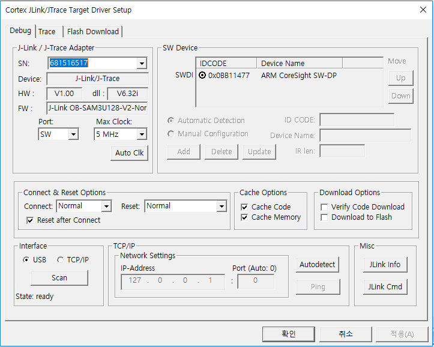

# MicroBot NRF SDK
Microbot-NRF SDK Getting started
===

Prerequisite
==
Development Hardware Kit
-
* Example Project target board
	* Microbot-IO of Naran
	* See Microbot-IO : https://microbot.is/others/
  

* Hardware specification
	* nrf51822 PinMap
 

Base
-
* Microbot-NRF uses Nordic NRF5x SDK v11.0.0 to support the following:
	* Download URL : https://infocenter.nordicsemi.com/index.jsp?topic=%2Fcom.nordic.infocenter.sdk5.v11.0.0%2Fgetting_started_installing.html
	* Nrf51 - s130(SoftDevice)
	* Nrf52 - s132(SoftDevice)

IDE
-
* Installation of Keil uVision4 or later IDE is required. Member registration is also required.
	* Download url : https://www.keil.com/download/product/
	* Installation Guide : https://yadom.fr/downloadable/download/sample/sample_id/202/

Firmware Download Tool
-
* J-Link is required.
	* Driver : https://www.segger.com/downloads/jlink/ (Normally Keil uVision installation is carried out at the same time.)	

Configuration
==
Define Endpoints or Events on MicrobotCloud
-
* Endpoints and Events can be defined using JSON.
* Based on defined Endpoints and Events, you can download gadget.h file which is used in Microbot-NRF library.
	* An Endpoint is represented by a Request which represents an action and the components of the Request are like the following:
		* Request
			* name : This is the call name for EndPoint.
			* params : This defines the payload of the endpoint and the payload of the Return. Payload can declare a multiple List. The declared payload is provided as a single structure.				
				* name : This is the member variable name of the structure.
				* type : This is the data type of the member variable.
					* char : 1 Byte
					* boolean : 1 Byte
					* uint8_t  : 1 Byte
					* uint16_t : 2 Byte
					* uint32_t : 4 Byte

				* length : the length of the argument
				* default : initialize value
			* return
				* name : This is the member variable name of the structure.
				* type : This is the data type of the argument.
					* char : 1 Byte
					* boolean : 1 Byte
					* uint8_t  : 1 Byte
					* uint16_t : 2 Byte
					* uint32_t : 4 Byte
				* length : the length of the argument
				* default : initialize value
				* dynamic_return : true & false
					* If the length of the return is variable, it should be set to true.
			* timeout : This is the timeout for receiving a return after calling EndPoint.
				* 0 means unidirectional communication without return.
			* Example : Request (JSON)

        ``` json
        "requests":[{
          "name":"set_pin",
          "params":[{
            "name":"pin_number",
            "type":"uint8_t",
            "length":1,
            "default":14
          }],
          "returns":[{
            "name":"result",
            "type":"uint8_t",
            "length":1,
            "default":0
          }],
          "timeout":5
          },
          {
          "name":"clear_pin",
          "params":[{
            "name":"pin_number",
            "type":"uint8_t",
            "length":1,
            "default":0
          }],
          "returns":[{
            "name":"result",
            "type":"uint8_t",
            "length":1,
            "default":0
          }],
          "timeout":5
          }]
        ```

			* Example : gadget.h

        ``` c
        typedef enum
        { 
          MIB_EP_SET_PIN = 0,
          MIB_EP_CLEAR_PIN = 1,
        } request_ids;


        typedef struct set_pin_t set_pin_t;
        struct set_pin_t
        { 
          uint8_t pin_number;
        };

        typedef struct set_pin_return_t set_pin_return_t;
        struct set_pin_return_t
        { 
          uint8_t result;
        };
        static set_pin_return_t* set_pin_return_size;

        typedef struct clear_pin_t clear_pin_t;
        struct clear_pin_t
        { 
          uint8_t pin_number;
        };

        typedef struct clear_pin_return_t clear_pin_return_t;
        struct clear_pin_return_t
        { 
          uint8_t result;
        };
        static clear_pin_return_t* clear_pin_return_size;
                
        void set_pin(ep_hnd* _hnd, set_pin_t* data_t);
        void clear_pin(ep_hnd* _hnd, clear_pin_t* data_t);
        ```
  

		* The components of Event are as follows.
			* name : This becomes the Event handler name.
			* params : This defines the payload of the Event. Payload can declare a multiple List.
        The declared payload is provided as a single structure. The name of the provided structure is automatically named by adding \ _t to events name.
				* name : This is the member variable name of the structure.
				* type : This is the data type of the member variable.
					* char : 1 Byte
					* boolean : 1 Byte
					* uint8_t  : 1 Byte
					* uint16_t : 2 Byte
					* uint32_t : 4 Byte
				* length : the length of the argument
				* default : initialize value 
				* Example : Event (JSON)


          ``` json
          "events":[{
            "name":"pin_interrupt",
            "params":[{
                "name":"pin_number",
                "type":"uint8_t",
                "length":1
                },
                {
                "name":"pin_state",
                "type":"uint8_t",
                "length":1
                }],
            "dynamic_event":"false"}]
          ```

				* Example : gadget.h

          ``` c
          typedef enum
          { 
            MIB_EVT_PIN_INTERRUPT = 0,
          } event_ids;

          typedef struct pin_interrupt_t pin_interrupt_t;
          struct pin_interrupt_t
          { 
            uint8_t pin_number;
            uint8_t pin_state;
          };
          ```
        
JSON Example
-
* If you upload example.json to the Microbot Console, you can download the following gadget.h.

```json
{
  "product": "mibio",
  "version": "0.1",
  "requests": [{
      "name": "set_pin",
      "params": [{
        "name": "pin_number",
        "type": "uint8_t",
        "length": 1,
        "default": 14
      }],
      "returns": [{
        "name": "result",
        "type": "uint8_t",
        "length": 1
      }],
      "timeout": 5
    },
    {
      "name": "clear_pin",
      "params": [{
        "name": "pin_number",
        "type": "uint8_t",
        "length": 1,
        "default": 14
      }],
      "returns": [{
        "name": "result",
        "type": "uint8_t",
        "length": 1
      }],
      "timeout": 5
    }
  ],
  "events": [{
    "name": "pin_interrupt",
    "params": [{
        "name": "pin_number",
        "type": "uint8_t",
        "length": 1
      },
      {
        "name": "pin_state",
        "type": "uint8_t",
        "length": 1
      }
    ]
  }]
}
```


* gadget.h of Example json
	* It is highly recommended that you never modify the downloaded gadget.h file.


``` c
/******************************************************
*
*
*
*
*       DO NOT FIX THIS FILE
*
*
*
*
*******************************************************/
#ifndef GADGET_H__
#define GADGET_H__
#include <stdio.h>
#include <stdint.h>
#include <stdlib.h>
#include "microbot.h"

#define FIRMWARE_VERSION_MAJOR 0
#define FIRMWARE_VERSION_MINOR 1
#define FIRMWARE_BUILD_NUMBER 0
#define MODEL_NUMBER 2
#define REQUEST_CNT 2
#define EVENT_CNT 1

static char MIB_PRODUCT_NAME[PRODUCT_NAME_LEN]  = "mibio";  // max 12

#pragma pack(push,1)
typedef enum
{ 
  MIB_EP_SET_PIN = 0,
  MIB_EP_CLEAR_PIN = 1,
} request_ids;

typedef struct set_pin_t set_pin_t;
struct set_pin_t
{ 
  uint8_t pin_number;
};

typedef struct set_pin_return_t set_pin_return_t;
struct set_pin_return_t
{ 
  uint8_t result;
};
static set_pin_return_t* set_pin_return_size;

typedef struct clear_pin_t clear_pin_t;
struct clear_pin_t
{ 
  uint8_t pin_number;
};

typedef struct clear_pin_return_t clear_pin_return_t;
struct clear_pin_return_t
{ 
  uint8_t result;
};
static clear_pin_return_t* clear_pin_return_size;

typedef enum
{ 
  MIB_EVT_PIN_INTERRUPT = 0,
} event_ids;

typedef struct pin_interrupt_t pin_interrupt_t;
struct pin_interrupt_t
{ 
  uint8_t pin_number;
  uint8_t pin_state;
};
#pragma pack(pop)

void set_pin(ep_hnd* _hnd, set_pin_t* data_t);
void clear_pin(ep_hnd* _hnd, clear_pin_t* data_t);

#ifndef GADGET_INIT__
#define GADGET_INIT__
static uint32_t mib_init(mib_init_t* init_data) {
  uint32_t err_code = NRF_SUCCESS;
  init_data->endpoints = (p_endpoints*)malloc(sizeof(p_endpoints) * REQUEST_CNT);
  init_data->return_size = (uint32_t*)malloc(sizeof(uint32_t) * REQUEST_CNT);
  
  init_data->endpoints[MIB_EP_SET_PIN] = set_pin;
  init_data->return_size[MIB_EP_SET_PIN] = sizeof(*set_pin_return_size);

  init_data->endpoints[MIB_EP_CLEAR_PIN] = clear_pin;
  init_data->return_size[MIB_EP_CLEAR_PIN] = sizeof(*clear_pin_return_size);

  init_data->model_number = MODEL_NUMBER;
  init_data->firmware_version_major = FIRMWARE_VERSION_MAJOR;
  init_data->firmware_version_minor = FIRMWARE_VERSION_MINOR;
  init_data->firmware_build_number = FIRMWARE_BUILD_NUMBER;
  memcpy(init_data->product_name, MIB_PRODUCT_NAME, PRODUCT_NAME_LEN);

  init_data->endpoint_length = REQUEST_CNT;

  err_code = mib_initialize(init_data);
  return err_code;
}
#endif // GADGET_INIT__
#endif // GADGET_H__
```

Usage
=
Example Project
-
* Unzip 'example.zip'
* NRF51822 & NRF51422
	* microbot-nrf_example_pca10028/s130\_with\_dfu_arm5_ble_app_hrs_s130_with_dfu_pca10028.uvprojx
* NRF52832 (# Beta Release)
	* microbot-nrf_example_pca10040/s132\_with\_dfu_arm5_ble_app_hrs_s130_with_dfu_pca10040.uvprojx

Example project options
-
* Check the properties of the project
	1. In the IDE screen, right click on the nrf51xxx _... / s13x folder in the Project Navigation screen at the upper left corner.
	2. Click options for Target 'nrf51xxx ... / s130' ... (Shortcut Alt + F7)
  
	3. When the Options for Target 'nrf...' Dialog window appears, check the following on each tab.
		* Device : Make sure that the device you want to test is selected correctly.
    
		* Target : Make sure IROM1, IRAM1 is checked and correct value.
			* nrf51422 & nrf51822
				* IROM1 (start : 0x1B000, size: 0x25000, startup : set)
				* IRAM1 (start : 0x20001F00, size 0x5100, noInit: clear)
			* nrf52832
				* IROM1 (start : 0x1B000, size: 0x25800, startup : set)
				* IRAM1 (start : 0x20002800, size 0xD800, noInit: clear)
        
		* C/C++ : Define (text input box) should show all of the following options.
			* BLE\_DFU\_APP_SUPPORT 
			* BLE\_STACK\_SUPPORT_REQD
			* NRF51 or NRF52 (Please Choice your device) 
			* S130 & S132 (Please Choice your device, nrf51:S130 & nrf52:S132)
			* SWI\_DISABLE0 
			* SOFTDEVICE\_PRESENT 
			* NRF\_LOG\_USES_UART=1
			* Copy this codes 

      ```
      BLE_DFU_APP_SUPPORT BLE_DFU_APP_SUPPORT BLE_STACK_SUPPORT_REQD SWI_DISABLE0 SOFTDEVICE_PRESENT NRF51&NRF52 S130&S132
      ```

      
		* Debug : Use drop box must be selected as J-LINK / J-TRACE Cortex. Press 'Settings' on the right to see the following options.
    
			* Debug tab
				* Port : SW
				* Click to 'Auto Clk'
			* Flash Download
				* select Erase Sectors
				* set to Program, Verify, Reset and Run check box
			* RAM for Algorithm
				* start: 0x20000000 size : 0x2000
      

Import Microbot-NRF library to Example Project
-
* Download from MicrobotCloud in 'Download SDK'
* Unzip 'microbot-nrf-sdk-v01.00.zip'
* When you unzip, you will see the following files in the lib folder:
	* microbot.h
	* mib_bsp.h
	* bsp\_btn\_ble.h
	* ble\_dfu.h
	* ble\_advdata.h
	* ble\_advertising.h
	* dfu\_app\_handler.h
	* nrf\_drv\_wdt.h
	* microbot-nrf51.lib or microbot-nrf52.lib
  
* Add new Group
	1. Run the Keil project.
	2. Right click the nrf51xxx \ _... / s13x folder in Project Navigation in the upper left corner of the IDE screen.
	3. Click Add Group ... to create a group named lib.
  
* Add Library file
	1. Right click on the 'lib' group created on the Project Navigation screen.
	2. Click Add Existing Files to Group 'lib' ...
  
	3. Select the target board version of NRF5x in the lib folder and click the Add button to add it.
  
* Add Include Path
	1. In the Project Navigation screen, right-click the nrf51xxx ... / s13x folder.
	2. Click options for Target 'nrf51xxx.../s13x'... . (Shortcut Alt + F7)
  
	3. Select the C / C ++ tab and enter the following in 'Include Paths':
		* To register the header file of the lib folder as the default path in the project, type the following:
    
  
Applying gadget.h to the Microbot-NRF library
-
* Assume that you include '. \\ lib' in the Keil Project Option in the step above.
* Download the gadget.h file generated by the json specification from the Microbot Console.
* Move the gadget.h file to the lib folder where the microbot-nrf5x.lib file is located.
* Or add the path where the gadget.h file is stored to 'include headers'.
	* In the example, the gadget.h file was added to the folder named dev.
  
  
* If you look at main.c in the Example Project, you will see a simple main.c definition like the following:

```c
// Step 1 : just add this header!!
#include "gadget.h"
#include "nrf_gpio.h"
#include "nrf_drv_gpiote.h"

// Step 2 : for the mib_init_t 
#define LED_0          				8					// BLUE
#define LED_1          				9 				// GREEN
#define LED_2          				10				// RED
#define BUTTON_0       				22
#define MIN_BATTERY_LEVEL			640				/**< Minimum battery level.  2.7V*/     //0%
#define MAX_BATTERY_LEVEL			770				/**< Maximum battery level. 4.1V*/ //    100%
#define BOARD_REVISION_MAJOR	0
#define BOARD_REVISION_MINOR	1
#define APP_VERSION_MAJOR			3
#define APP_VERSION_MINOR			37
#define INTERRUPT_PIN 				12

// Step 3 : define mib_init_t 
static mib_init_t        microbot_init;

// Step 4 : microbot-nrf event_handler, more case 'Microbot sdk document'
void microbot_evt_handler(ble_microbot_evt_t * p_evt)
{
  switch (p_evt->evt_type)
  {
  case MIB_EVT_REVEAL:
    break;
  case MIB_EVT_CONNECTED:
    break;
  case MIB_EVT_DISCONNECTED:
    break;
  case MIB_EVT_BTN_PUSH:
    break;
  case MIB_EVT_BTN_RELEASE:
    break;
  case MIB_EVT_BTN_LONG_PUSH:
    break;
  default:
    break;
  }
}

// Step 5 : Copy & Paste of endpoint functions in gadget.h
//          and Definition of endpoints
void set_pin(ep_hnd* _hnd, set_pin_t* data)
{
  nrf_gpio_cfg_output(data->pin_number);
  nrf_gpio_pin_set(data->pin_number);
  mib_return(_hnd, data);
}
void clear_pin(ep_hnd* _hnd, clear_pin_t* data)
{
  nrf_gpio_cfg_output(data->pin_number);
  nrf_gpio_pin_clear(data->pin_number);
  mib_return(_hnd, data);
}

static void init()
{
  uint32_t err_code;
  microbot_init.evt_handler = microbot_evt_handler;
  microbot_init.led_red_pin_number = LED_2;
  microbot_init.led_green_pin_number = LED_1;
  microbot_init.led_blue_pin_number  = LED_0;
  microbot_init.max_batt  = MAX_BATTERY_LEVEL;
  microbot_init.min_batt  = MIN_BATTERY_LEVEL;
  microbot_init.button_pin_number = BUTTON_0;
  microbot_init.button_active_state  = false;
  microbot_init.bsp_button_pull = NRF_GPIO_PIN_PULLUP;

  // Step 6 : call 'mib_init()'! do not call 'mib_initialize()'
  err_code = mib_init(&microbot_init);
  APP_ERROR_CHECK(err_code);
}

void interrupt_handler(nrf_drv_gpiote_pin_t pin, nrf_gpiote_polarity_t action)
{
  pin_interrupt_t data;
  data.pin_number = (uint8_t)pin;
  data.pin_state = action;
  // Step 7 : raise event definition like this function
  mib_event_write(MIB_EVT_PIN_INTERRUPT, &data, sizeof(pin_interrupt_t));
}

static void pin_interrupt_init()
{
  // gyro gpio interrupt
  nrf_drv_gpiote_in_config_t pin_interrupt_config_in = GPIOTE_CONFIG_IN_SENSE_TOGGLE(false);
  pin_interrupt_config_in.pull = NRF_GPIO_PIN_PULLDOWN;
  nrf_drv_gpiote_in_init(INTERRUPT_PIN, &pin_interrupt_config_in, interrupt_handler);
  nrf_drv_gpiote_in_event_enable(INTERRUPT_PIN, true);
}

int main(void)
{
  init();
  pin_interrupt_init();
  // Step 8 : call microbot service loop
  start_microbot();
}
```

* Description of example 'main.c'
	* Step 1 : include "gadget.h" 
	* Step 2 : declare pin number variable for the mib_init_t 
	* Step 3 : declare mib_init_t structure 
	* Step 4 : definition microbot-nrf event_handler, more case 'Microbot-SDK Document'
	* Step 5 : Copy & Paste of endpoint functions in gadget.h, and Definition of endpoints
	* Step 6 : call 'mib_init()'! do not call 'mib_initialize()'
	* Step 7 : raise event definition like 'pin_interrupt_init()'
	* Step 8 : call microbot service loop


* The downloaded gadget.h is generated by json specified in the microbot console.
* It is highly recommend that you do not modify the generated gadget.h.

First time build of example project
-
1. Download and Unzip to 'example.zip'
2. Download and Unzip to 'microbot-nrf.zip'
3. Import library to example project
4. Download 'gadget.h' from Microbot Console, and paste to 'dev' folder
5. build(F7) and Run(F8)