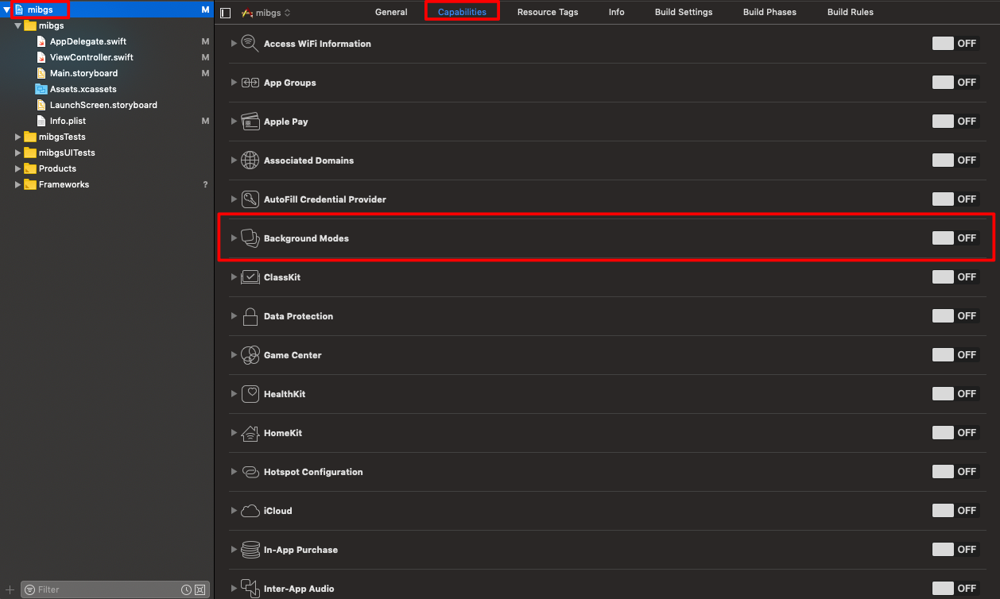
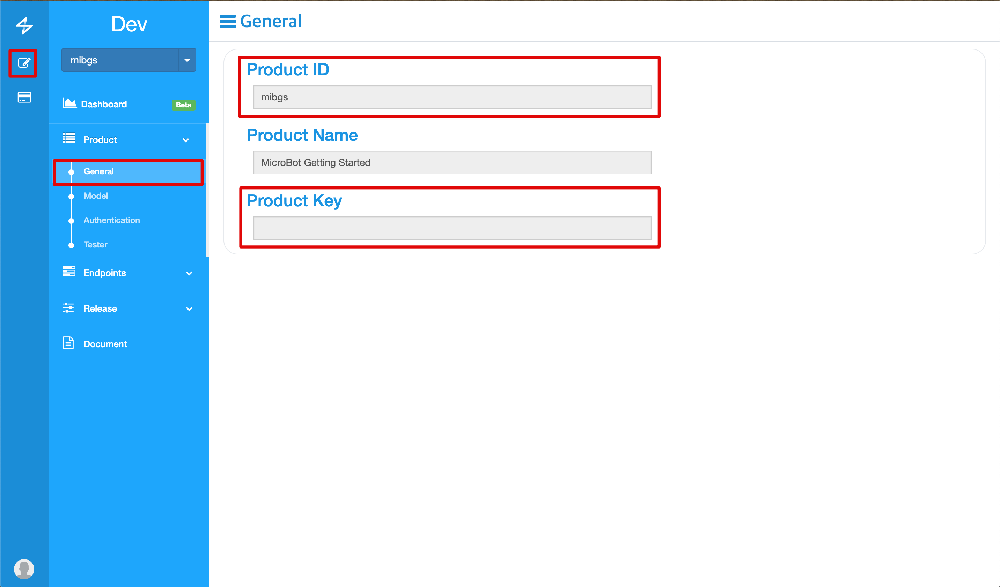

# MicroBot Swift Getting Started

## Overview

This document contains a description of initial setup and basic function usage when developing Swift.

## History

* 2019-02-22 : Overall changes have been made.

## Step

1. [Prerequisites](#Prerequisites)
1. [Installation](#installation)
1. [Usage](#usage)

## Prerequisites

Before you begin, you need to set up a few things in your environment:

* Xcode 10.0 is recommended and supports more than 9.0.
* iOS 12 is recommended, and 10 or more support is available.
* Swift projects must use Swift 4.1 or later
* The bundle identifier of your app
* For MicroBot:
  * A physical Gadget & iOS device
  * An Apple Push Notification Authentication Key for your Apple Developer account

## Installation

#### CocoaPods

* Comming Soon

#### Manually

1. Download the MicroBot Swift-SDK ([Download](https://github.com/thenaran/document/blob/master/microbot-swift/release/0.0.1/MicroBot.framework.zip))
1. Unzip the downloaded SDK and move the Framework file to the project folder.
1. In Build Phases, click the [+] button in the Link Binary Libraries item.

    

1. Click [Add Other ...]

    

1. Select the Framework you copied in the project folder.

    

1. In General, click the [+] button in the Embedded Binaries item.

    

1. Select MicroBot.framework under Frameworks and add it.

    

## Configuration

#### Configuring APNs

1. Please refer to the following link to create and configure APNS.
    * Link : [Link](https://medium.com/@ankushaggarwal/generate-apns-certificate-for-ios-push-notifications-85e4a917d522)
1. Go to the MiB Console and click [Organization] of the profile in the upper right corner.

    

1. Go to the [Notification Key] tab and click the [Register IOS] button.

    

1. Fill in the following items. Fill in all and register.
    * State : Choose whether to be for development or for commercial use.
    * Bundle ID : Fill in the generated app id.
    * Password : p12 Fill in the password entered during the authentication process.
    * File : Select the created p12 file.

    

#### Configuring Capabilities in your project

1. Turn on the Background of the Capabilities.

    

1. Check 'Uses Bluetooth LE accessories' and 'Remote notifications'

    

1. Turn on the Push Notifications of the Capabilities.

    

1. Check that the turn on

    

#### Add Your Product Keys

You need to add a product key to communicate with gadgets. Follow the steps below to add the product key.

1. Access the MiB console and go to [Product] - [General]. Copy the Product ID and Product Key values shown on the screen.

    

1. Click the [+] button on the Information Property List of the info.plist file and fill in the key value of ProductKeys.

    

1. Change the Type of ProductKeys that you added to Dicionary. Then add an item to the bottom of ProductKeys to fill the Product Key with Product ID and Value with Product Key..

    

## Usage

#### Initialize

```swift
// Import MicroBot in your UIApplicationDelegate
import MicroBot

// Send push notification to MicroBot for handle requests from the MicroBot Cloud
func application(_ application: UIApplication, didReceiveRemoteNotification userInfo: [AnyHashable: Any],
                 fetchCompletionHandler completionHandler: @escaping (UIBackgroundFetchResult) -> Void) {
    MicroBot.shared.message.digestNotification(userInfo).done { (void) in
        completionHandler(UIBackgroundFetchResult.newData)
    }
}

// APNs token for MicroBot Cloud
func application(_ application: UIApplication, didRegisterForRemoteNotificationsWithDeviceToken deviceToken: Data) {
    print("APNs token retrieved: \(deviceToken)")
    MicroBot.shared.message.token = deviceToken
}

```

#### Receive Events

```swift
import MicroBot

class EventReciever: MicroBotDelegate {
    init() {
        super.init()
        MicroBot.shared.delegate = self
    }

    func mibReceivedAuthEvent(_ user: MIBUser, topic: String, data: [AnyHashable: Any]?) {
        print("Recieved event from \(user) user. topic: \(topic)")
    }

    func mibReceivedGadgetEvenet(_ gadget: MIBGadget, topic: String, data: [AnyHashable: Any]?) {
        print("Recieved event from gadget. topic: \(topic)")
    }

    func mibReceivedHubEvent(_ hub: MIBHub, topic: String, data: [AnyHashable: Any]?) {
        print("Received event from hub. topic: \(topic)")
    }

}

```

#### Authorize User

```swift
import MicroBot

class ViewController: UIViewController {

    func auth(_ email: String){
        // Request user authroization to MicroBot Cloud. Email is required
        MicroBot.shared.auth.authorize(email).done { (resp) in
            if let userId = resp.data {
                print("email: \(email), userId: \(userId)")
            }
        }
    }

    // Recieve an authroization event from MicroBotDelegate
    func mibReceivedAuthEvent(_ user: MIBUser, topic: String, data: [AnyHashable: Any]?) {
        print("Recieved event from \(user) user. topic: \(topic)")
        if topic == "authorized" {
            print("\(user.email) is authroized.")
        } else if topic == "unauthorized" {
            print("\(user.email) is unauthorized.")
        }
    }
}

```

#### Scan Gadgets

```swift
class ViewController: UIViewController {

    func selectedScanButton() {
        MicroBot.shared.gadgets.scan().done { (resp) in
            let gadget = resp.data!
            print("Scaned gadget name : \(gadget.name)")
        }
    }
}
```

#### Pair and Unpair with The Gadget

```swift
import MicroBot

class ViewController: UIViewController {

    func pair(_ gadget: MIBGadget, otp: Int) {
        gadget.pair(otpSecret: otp).done({ (resp) in
            print("Try pair result: \(String(describing: resp.data))")
        })
    }

    func unpair(_ gadget: MIBGadget) {
        gadget.unpair().done({ (resp) in
            print("Try unpair result: \(String(describing: resp.data))")
        })
    }

    // Recieve a pair event from MicroBotDelegate
    func mibReceivedGadgetEvent(_ gadget: MIBGadget, topic: String, data: [AnyHashable: Any]?) {
        if topic == "paired" {
            print("Paired with new gadget: \(gadget.name)")
        } else if topic == "unpaired" {
            print("Unpaired with gadget: \(gadget.name)")
        }
    }
}

```

#### Call an Endpoint of The Gadget

```swift
import MicroBot

class ViewController: UIViewController {

    func press(_ gadget: MIBGadget, otp: Int, pinNumber: Int) {
        // Call an endpoint of Gadget
       gadget.callEndpoint(otp, name: "set_pin", args: pinNumber).done { (resp) in
           print("set_pin result: \(String(describing: resp.data))")
       )}
    }
}
```
